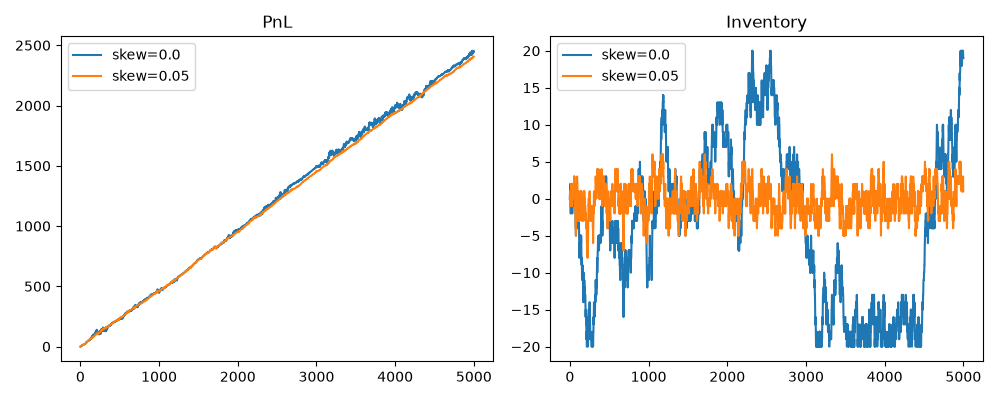

# market-making-sim
Order-book simulator testing whether inventory-skewed quoting beats symmetric quoting for a market maker under a hard position limit.
# Market-Making Simulator

Testing whether **inventory-skewed quoting** beats symmetric quoting for a
market maker operating under a hard position limit.

## Setup

- Fair value follows an Ornstein–Uhlenbeck (mean-reverting) process
- The bot posts a two-sided quote each tick; fill probability decays
  exponentially with distance from fair value
- Hard position limit of ±20; PnL marked to market each tick
- Skewed version shifts both quotes by `−k × inventory`

## Results — inventory skew (spread = 1.0, 200 paths)

| skew k | mean PnL | PnL σ | Sharpe | mean max \|inv\| |
|--------|---------:|------:|-------:|-----------------:|
| 0.00   | 2443.3   | 52.2  | 10.18  | 20.0             |
| 0.02   | 2453.6   | 44.3  | 33.51  | 10.8             |
| 0.05   | 2425.1   | 37.1  | 47.79  |  7.2             |
| 0.10   | 2379.2   | 35.1  | 58.77  |  5.1             |
| 0.20   | 2282.8   | 30.7  | 65.79  |  3.0             |



## Results — spread sweep (skew = 0.05)

| spread | mean PnL | Sharpe | mean max \|inv\| |
|-------:|---------:|-------:|-----------------:|
| 0.4    | 1370.5   | 39.16  | 5.2              |
| 0.8    | 2181.7   | 47.40  | 6.7              |
| 1.0    | 2425.1   | 47.79  | 7.2              |
| 1.2    | 2590.6   | 46.96  | 7.6              |
| 1.6    | 2727.6   | 43.48  | 8.2              |
| 2.0    | 2692.7   | 39.14  | 8.5              |
| 3.0    | 2231.9   | 28.67  | 8.6              |

## Takeaways

1. **Without skew, inventory pins at the position limit.** At k = 0 the
   inventory path repeatedly saturates at ±20 — the bot stops market-making
   and becomes a directional bet. Mean PnL looks healthy, but path-to-path
   dispersion is the largest of any configuration tested (σ = 52.2).

2. **Skewging quotes by −k × inventory is almost free insurance.** At
   k = 0.05, max inventory falls 64% and Sharpe rises 4.7×, while mean PnL
   falls only 0.7%. Beyond k = 0.05 the Sharpe keeps improving but PnL
   starts to erode (−6.6% at k = 0.20) — the desk is paying away edge for
   stability it no longer needs.

3. **Spread has an interior optimum, and it depends on the objective.**
   Sharpe peaks at spread = 1.0 (47.8) while raw PnL peaks at spread = 1.6
   (2727.6). Too tight → the edge per fill doesn't compensate for inventory
   risk; too wide → fills dry up and PnL falls despite the higher edge.

## Limitations

- **No adverse selection.** In reality a fill is often informative — the
  counterparty knew something. Here fills are independent of future price
  moves, which flatters the strategy.
- **Sharpe is not annualised conventionally.** It is computed per-tick and
  scaled by √n, treating ticks as i.i.d. The absolute number is inflated;
  only the *relative* comparison across configurations is meaningful.
- **Single-venue, no queue position.** All quotes are assumed to be at the
  front of the queue and there is no competing liquidity.
- **Symmetric fill model.** Both sides use the same decay parameter, so the
  model does not capture one-sided order-flow pressure.

## Run

```bash
pip install numpy matplotlib
python mm_sim.py
```

## Next steps

- Split PnL into **spread capture** vs **inventory drift**
- Add adverse selection: drift fair value against the fill direction
- Replace mid with **order-book imbalance** as the fair value estimate
- Model competing market makers and queue position
